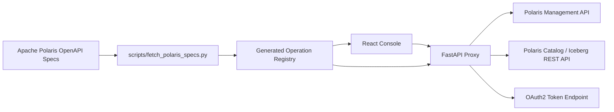
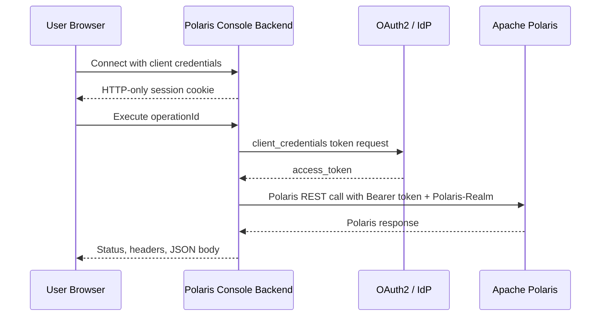
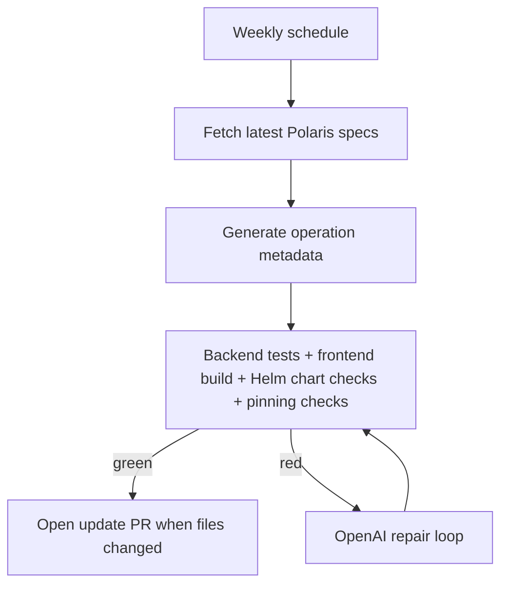

# Polaris Console

[](https://github.com/tsukubatexas/polaris-console/actions/workflows/ci.yml)
[](https://github.com/tsukubatexas/polaris-console/actions/workflows/helm.yml)
[](https://github.com/tsukubatexas/polaris-console/actions/workflows/codeql.yml)

Web console for Apache Polaris.

Polaris Console turns the Apache Polaris OpenAPI surface into a dynamic React UI backed by a Python FastAPI proxy. The console keeps the product simple for humans, while the repository keeps itself fresh with scheduled OpenAPI refreshes, generated operation metadata, CI checks, and optional OpenAI repair loops.

## What It Does

- Connects to Apache Polaris with the same practical auth modes used by Polaris clients: bearer token, OAuth2 client credentials, or no auth for local development.
- Exposes curated views for catalogs, identity, lakehouse objects, and activity.
- Provides a full Operation Explorer for every generated Polaris operationId.
- Keeps secrets out of the browser by storing tokens only in the backend session store.
- Generates frontend and backend operation registries directly from the Apache Polaris OpenAPI specs.
- Runs scheduled update loops that can open PRs when new Polaris releases change the API surface.



## Quick Start

```bash
python -m pip install -e ".[dev]"

cd frontend
npm install
cd ..

uvicorn backend.app.main:app --reload --port 8000
```

In a second terminal:

```bash
cd frontend
npm run dev
```

Open `http://localhost:5173`.

The Vite dev server proxies `/api` to `http://localhost:8000`.

## Auth Modes

Bearer mode:

- User pastes a bearer token into the connection modal.
- Browser receives only an HTTP-only session cookie.
- FastAPI forwards `Authorization: Bearer <token>` and `Polaris-Realm`.

OAuth2 client credentials mode:

- User enters token URL, client ID, client secret, and optional scope.
- FastAPI exchanges credentials server-side.
- Access tokens are cached in memory until shortly before expiry.
- Browser never receives the client secret or access token.

No auth mode:

- Useful only for local Polaris development.
- No `Authorization` header is sent.



## Dynamic API Coverage

The generated registry currently includes management, catalog, and Iceberg REST operations from:

`https://github.com/apache/polaris/tree/apache-polaris-1.5.0/spec`

Regenerate it manually:

```bash
POLARIS_RELEASE=latest scripts/fetch_polaris_specs.py
scripts/run_checks.sh
```

Use a local spec checkout:

```bash
POLARIS_SPEC_SOURCE_DIR=/path/to/apache-polaris/spec \
  scripts/fetch_polaris_specs.py --release apache-polaris-local
```

## Automation



Workflows:

- `ci`: validates Python, React, generated registries, tests, and pinned actions.
- `agentic update`: weekly OpenAPI refresh with optional OpenAI repair via `OPENAI_API_KEY`.
- `container`: smoke-tests and publishes the hardened container image to GitHub Container Registry.
- `helm`: validates schema, lint, secure rendering, package generation, and publishes the public Helm repository on `gh-pages`.
- `monthly hygiene`: closes stale automated PRs.
- `quarterly cleanup`: deeper dependency and generated-surface cleanup.
- `release`: Release Please keeps changelog and GitHub releases moving.

## Helm Install

The chart is intentionally fail-closed: production renders require an explicit Polaris/OAuth host allowlist so the backend cannot become a generic server-side request proxy.

After the `helm` workflow has published the chart, install from the public raw GitHub chart index:

```bash
helm repo add polaris-console https://raw.githubusercontent.com/tsukubatexas/polaris-console/gh-pages/charts
helm repo update
helm upgrade --install polaris-console polaris-console/polaris-console \
  --namespace polaris-console \
  --create-namespace \
  --set config.allowedTargetHosts="{polaris.example.com,login.microsoftonline.com}" \
  --set config.allowedOrigins="{https://polaris-console.example.com}"
```

Local development can opt into the relaxed profile:

```bash
helm template polaris-console charts/polaris-console -f charts/polaris-console/values-dev.yaml
```

Chart security defaults:

- Runs as UID/GID `10001`, non-root, with `allowPrivilegeEscalation=false`.
- Drops all Linux capabilities and uses `RuntimeDefault` seccomp.
- Uses read-only root filesystem with an explicit `/tmp` `emptyDir`.
- Creates or reuses a Kubernetes Secret for the backend session secret.
- Sets `POLARIS_CONSOLE_COOKIE_SECURE=true` by default.
- Requires `POLARIS_CONSOLE_ALLOWED_TARGET_HOSTS` unless local development mode is explicit.
- Enables a NetworkPolicy by default; production deployments should add explicit egress rules for Polaris, OAuth, DNS, and observability endpoints.
- Ships a Helm `values.schema.json` so invalid values fail early.

## Security Posture

- Tokens are never stored in localStorage or rendered into frontend state.
- Browser gets only an HTTP-only session cookie.
- Production deployments should set `POLARIS_CONSOLE_COOKIE_SECURE=true`.
- Production deployments should set `POLARIS_CONSOLE_ALLOWED_TARGET_HOSTS` to the exact Polaris and OAuth hosts the backend may call.
- GitHub Actions are pinned to commit SHAs.
- The agentic repair loop receives check output and repository diffs, not runtime secrets.

## Environment

```bash
POLARIS_CONSOLE_SESSION_SECRET=change-me-at-least-32-bytes
POLARIS_CONSOLE_ALLOWED_ORIGINS=https://console.example.com
POLARIS_CONSOLE_ALLOWED_TARGET_HOSTS=polaris.example.com,login.microsoftonline.com
POLARIS_CONSOLE_COOKIE_SECURE=true
POLARIS_CONSOLE_ALLOW_INSECURE_TLS=false
```

## Development Checks

```bash
scripts/run_checks.sh
```

The check script runs:

- workflow YAML parsing
- generated-registry consistency
- pinned-action validation
- Ruff
- Pytest
- TypeScript
- Vite production build
- Helm chart validation

Container smoke test:

```bash
docker build -t polaris-console:test .
scripts/container_smoke_test.sh polaris-console:test
```

## Status

This repository is a proof of concept for a production-grade Polaris operations console. The dynamic explorer gives broad API coverage immediately; teams can add curated screens on top of the same generated registry as their Polaris workflows mature.
