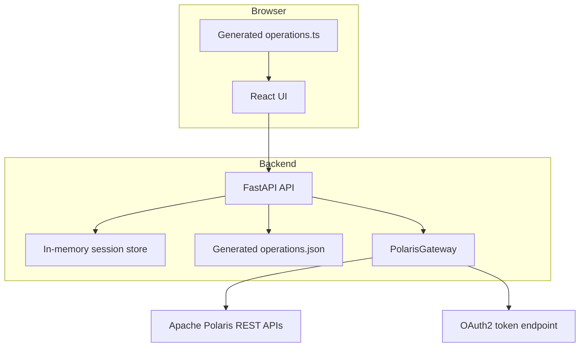
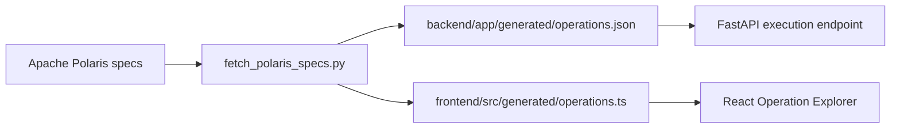

# Architecture

Polaris Console is split into a React control surface and a Python proxy. The proxy is the trust boundary.

The frontend does not know how to authenticate to Polaris directly. It asks the backend to execute a generated operationId with path parameters, query parameters, and optional JSON body.

The backend resolves that operationId from `operations.json`, expands the path, attaches auth headers, and calls the configured Polaris API.

## Why A Backend Proxy

- OAuth client secrets stay server-side.
- Bearer tokens are not stored in browser storage.
- The backend can restrict allowed target hosts.
- The UI can use the same execution model for every Polaris REST operation.

## Generated Surface

Generated data is intentionally simple: operationId, service, method, path, path/query/header parameters, request schema hints, response codes, and whether the operation mutates state.
